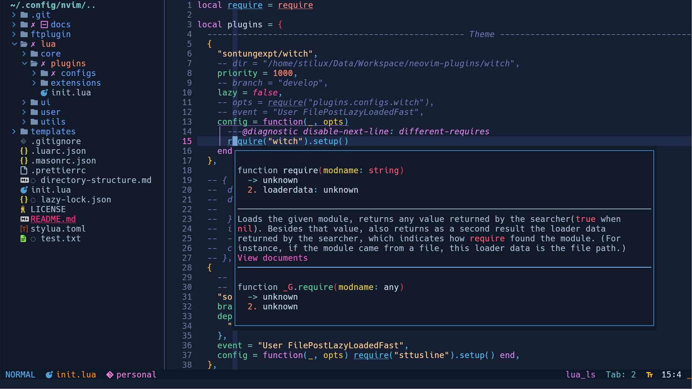

This is the distro neovim for fullstack development.

🚀 Performance for time startup: 24ms - 50ms(about 50 plugins)

## Features

| Plugin                                                                                                               | Description                                                                                        |
| -------------------------------------------------------------------------------------------------------------------- | -------------------------------------------------------------------------------------------------- |
| [lazy](https://github.com/folke/lazy.nvim)                                                                           | A plugin manager that loads plugins lazily to ensure fast startup times.                           |
| [nvim-lspconfig](https://github.com/neovim/nvim-lspconfig)                                                           | Support default lsp for (lua, python, web development, java, bash, c-c++ )                         |
| [mason](https://github.com/williamboman/mason.nvim)                                                                  | Automatically installs LSP servers, formatters, linters, and debug adapters                        |
| [conform](https://github.com/stevearc/conform.nvim)                                                                  | Fast formatter                                                                                     |
| [nvim-cmp](https://github.com/hrsh7th/nvim-cmp)                                                                      | A lightweight completion plugin                                                                    |
| [witch](https://github.com/sontungexpt/witch)                                                                        | Main theme                                                                                         |
| [url-open](https://github.com/sontungexpt/url-open)                                                                  | Great plugin to open the url under cursor                                                          |
| [stcursorword](https://github.com/sontungexpt/stcursorword)                                                          | Highlight all words similar to the word under the cursor                                           |
| [buffer-closer](https://github.com/sontungexpt/buffer-closer)                                                        | Automatic close unused buffers                                                                     |
| [nvim-tree](https://github.com/nvim-tree/nvim-tree.lua)                                                              | A fast and lightweight file explorer                                                               |
| [toggleterm](https://github.com/akinsho/toggleterm.nvim)                                                             | Includes a terminal using toggleterm                                                               |
| [gitsigns](https://github.com/lewis6991/gitsigns.nvim), [git-conflict](https://github.com/akinsho/git-conflict.nvim) | Integrates Git functionality with gitsigns and git-conflict plugins for a seamless Git experience. |
| [comment](https://github.com/numToStr/Comment.nvim)                                                                  | A plugin for easily generating comments.                                                           |
| [dap](https://github.com/mfussenegger/nvim-dap), [dapui](https://github.com/rcarriga/nvim-dap-ui)                    | Offers debugging capabilities with dap and dapui plugins.                                          |
| [treesitter](https://github.com/nvim-treesitter/nvim-treesitter)                                                     | Provides syntax highlighting                                                                       |
| [autopairs](https://github.com/windwp/nvim-autopairs)                                                                | Auto generate pairs                                                                                |
| [rainbow-delimiters](https://github.com/HiPhish/rainbow-delimiters.nvim)                                             | Beautiful bracket highlighting                                                                     |
| [ccc](https://github.com/uga-rosa/ccc.nvim)                                                                          | A color picker using ccc                                                                           |
| [sttusline](https://github.com/sontungexpt/sttusline)                                                                | A very lightweight, super fast and lazyloading statusline plugin for neovim written in lua         |
| [telescope](https://github.com/nvim-telescope/telescope.nvim)                                                        | Provides a file finder using telescope, a fuzzy finder plugin for files, buffers, and more.        |

And many more plugins that you can see in [plugins/init.lua](./lua/plugins/init.lua)

## Preview




## How to add more key map

- We provide you two files for keymap.

  - One for plugin key map (~/.config/nvim/lua/core/plugmap.lua).(This file will
    be load on startup)

  - One for some custom default nvim map (~/.config/nvim/lua/core/nvimmap.lua).
    In this file if any keymap you want it run on startup please put your map
    function in map_on_startup function

- We provide you a function to map

```lua
    ---@tparam table|string mode : Table mode used for applying the key map if only one mode you can use string
    ---@tparam string key : The key you wish to map.
    ---@tparam function|string map_to : The key or function to be executed by the keymap.
    ---@tparam table|number opts : Options to be applied in vim.keymap.set.
    --- - Default opts = 1.
    --- - opts = 1 for noremap and silent and nowait.
    --- - opts = 2 for not noremap and silent.
    --- - opts = 3 for noremap and not silent.
    --- - opts = 4 for not noremap and not silent.
    --- - opts = 5 for expr and noremap and silent.
    --- - opts = 6 for noremap and silent and wait.
    --- - opts = 7 for noremap and silent and nowait and expr.
    ---@tparam table extend_opts: Extension or overriding of opts if opts is a number.
    require("utils.mapper").map(mode, key, map_to, opts, extend_opts)

    --- Examples:
	require("utils.mapper").map({ "n", "v" }, "gx", "<esc>:URLOpenUnderCursor<cr>", { desc = "Open URL under cursor" })
	require("utils.mapper").map("n" }, "gx", "<esc>:URLOpenUnderCursor<cr>", 2, { desc = "Open URL under cursor" })
```

## Install LSP, debugger

- We use mason plugin to automatically install lsps, debuggers, linters
- To ensure a package is automatically synced on startup, you can create a `.masonrc.json` file in the project's root directory or add
  packages to ensured_installed in ~/.config/nvim/lua/plugins/configs/mason.lua
- If you want disable automatically synced mason packages on startup, you can change
  `auto_sync = false` in ~/.config/nvim/lua/plugins/configs/mason.lua
- Additionally, you can manually sync the package by using the command `:MasonSyncPackages` in your neovim

- Example .masonrc.json
  

## Requirements

- xclip (for clipboard support)
- fd (for telescope)
- ripgrep (for telescope)
- Nerdfonts (for icons) (I use Hack Nerd Font)
- Neovim 0.5 or higher

Arch Linux:

```bash
sudo pacman -S xclip fd ripgrep
```

```bash
yay -S ttf-hack-nerd
```

## Installation

Clone this repository into your Neovim configuration directory.

Linux and MacOS:

SSH method (recommended)

```bash
[ -d ~/.config/nvim ] && mv ~/.config/nvim ~/.config/nvim.bak ; git clone git@github.com:sontungexpt/stinvim.git ~/.config/nvim --depth 1
```

```bash
[ -d ~/.config/nvim ] && mv ~/.config/nvim ~/.config/nvim.bak ; git clone https://github.com/sontungexpt/stinvim.git ~/.config/nvim --depth 1
```

Windows (git bash)

```bash
[ -d %USERPROFILE%/Local/nvim ] && mv %USERPROFILE%\AppData\Local\nvim %USERPROFILE%\AppData\Local\nvim.bak ; git clone https://github.com/sontungexpt/stinvim.git %USERPROFILE%\AppData\Local\nvim --depth 1
```

You will also need to install the plugins. This configuration uses the lazy.nvim plugin manager to manage plugins. You can install the plugins by opening Neovim and running `:Lazy sync`

In this distro we enable two providers: nodejs and python so please install it or you can disable it in file ~/.config/nvim/lua/core/provider.lua

```bash
# for nodejs
npm install -g neovim

# for ruby
# gem install neovim

# for python
python3 -m venv .venv
source .venv/bin/activate
pip install --upgrade pip
pip install neovim
```

```vim
:Lazy sync
```

## Inspiration

- [neovim-config](https://github.com/sontungexpt/neovim-config)

## Configuration

This configuration is highly customizable and easy to configure.

## Folder Structure

```
├── ftplugin
│   └── java.lua
├── lua
│   ├── core
│   │   ├── autocmd.lua
│   │   ├── autofiletype.lua
│   │   ├── command.lua
│   │   ├── nvimmap.lua
│   │   ├── option.lua
│   │   ├── plugmap.lua
│   │   └── provider.lua
│   ├── plugins
│   │   ├── configs
│   │   │   ├── buffer-closer.lua
│   │   │   ├── bufferline.lua
│   │   │   ├── cmp
│   │   │   │   ├── init.lua
│   │   │   │   └── LuaSnip.lua
│   │   │   ├── comment
│   │   │   │   ├── Comment.lua
│   │   │   │   └── todo-comments.lua
│   │   │   ├── copilot.lua
│   │   │   ├── dap
│   │   │   │   ├── dapui.lua
│   │   │   │   ├── dap-virtual-text.lua
│   │   │   │   ├── init.lua
│   │   │   │   ├── paths.lua
│   │   │   │   └── utils.lua
│   │   │   ├── git
│   │   │   │   ├── git-conflict.lua
│   │   │   │   └── gitsigns.lua
│   │   │   ├── highlight-colors.lua
│   │   │   ├── indent-blankline.lua
│   │   │   ├── lazy-nvim.lua
│   │   │   ├── lsp
│   │   │   │   ├── conform.lua
│   │   │   │   ├── general-confs.lua
│   │   │   │   ├── lspconfig.lua
│   │   │   │   └── lspsaga.lua
│   │   │   ├── lualine
│   │   │   │   ├── components
│   │   │   │   │   ├── copilot.lua
│   │   │   │   │   ├── diagnostics.lua
│   │   │   │   │   ├── encoding.lua
│   │   │   │   │   ├── file.lua
│   │   │   │   │   ├── git.lua
│   │   │   │   │   ├── indent.lua
│   │   │   │   │   ├── location.lua
│   │   │   │   │   ├── lsp_servers.lua
│   │   │   │   │   ├── mode.lua
│   │   │   │   │   └── time.lua
│   │   │   │   └── init.lua
│   │   │   ├── mason.lua
│   │   │   ├── nvim-autopairs.lua
│   │   │   ├── nvim-tree.lua
│   │   │   ├── nvim-treesitter.lua
│   │   │   ├── nvim-ufo.lua
│   │   │   ├── stcursorword.lua
│   │   │   ├── sttusline
│   │   │   │   └── init.lua
│   │   │   ├── telescope
│   │   │   │   └── init.lua
│   │   │   ├── toggleterm.lua
│   │   │   ├── tokyonight.lua
│   │   │   ├── url-open.lua
│   │   │   ├── whichkey.lua
│   │   │   └── wilder.lua
│   │   ├── extensions
│   │   │   ├── copilot.lua
│   │   │   ├── git-conflict.lua
│   │   │   ├── lualine.lua
│   │   │   └── mason.lua
│   │   └── init.lua
│   ├── ui
│   │   ├── border.lua
│   │   ├── colors.lua
│   │   ├── icons
│   │   │   ├── devicon.lua
│   │   │   └── lspkind.lua
│   │   ├── init.lua
│   │   └── lualine.lua
│   └── utils
│   ├── bootstrap.lua
│   ├── init.lua
│   ├── mapper.lua
│   ├── notify.lua
│   ├── plug-extension.lua
│   └── reloader.lua
├── templates
│   └── plug_autocmd.txt
├── .masonrc.json
├── lazy-lock.json
├── LICENSE
└── init.lua
```

## Contributions

If you find any issues with this configuration or would like to contribute, please feel free to submit a pull request or open an issue.

## License

This configuration is licensed under the MIT license - see the [LICENSE](LICENSE) file for details.
